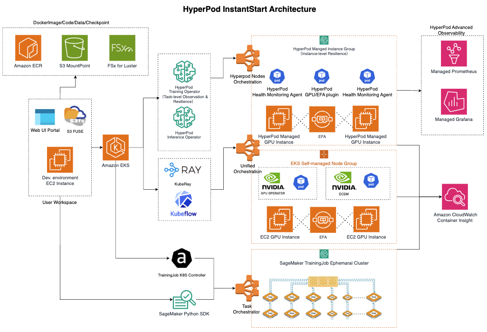

# HyperPod-InstantStart

    
    

HyperPod InstantStart is a training-and-inference integrated platform built on SageMaker HyperPod. It utilizes standard EKS orchestration and supports training and inference tasks with arbitrary GPU resource granularity. 

## Overview

HyperPod-InstantStart provides a unified interface for managing ML infrastructure, from cluster provisioning to training job orchestration and model serving.

- For training, it leverages HyperPod Training Operator (significantly simplifying distributed configuration with process-level recovery and log exception monitoring; optional), or KubeRay (as an orchestrator for the reinforcement learning framework VERL).
- For inference, it supports deployment on single or multi-node setups using arbitrary containers, such as standard vLLM/SGLang or self-buit containers, while also providing standardized API exposure (e.g., OpenAI-compatible API). 
- Additionally, it offers managed MLFlow Tracking Server for storing training metrics, enabling sharing and collaboration with fine-grained IAM permission controls.

## Architecture

## Demo Videos

### Create HyperPod Cluster

### Download Model from HuggingFace

### Model Deployment from S3

### Distributed Verl Training with KubeRay

## Key Components in Web UI Panel

- **Cluster Management**: Supports EKS cluster creation, importing existing EKS clusters, cluster environment configuration, HyperPod cluster creation and scaling, EKS Node Group creation
- **Model Management**: Supports multiple S3 CSI configurations, as well as HuggingFace model downloads (CPU Pod)
- **Inference**: Hosting for vLLM, SGLang or any custom container, with support for binding Pods to different Services (no need to repeatedly destroy and create Pods during resource rebalancing)
- **Training**: Supports model training patterns including LlamaFactory, Verl, and Torch Script
- **Training History**: Integration with SageMaker-managed MLFlow creation and display/sharing of training performance metrics

For detailed setup instructions, please refer to [Feishu Doc (zh_cn)](https://amzn-chn.feishu.cn/docx/VZfAdXTJKor7TCxPrZdcbGYXnaf?from=from_copylink), or [Lark Doc (en)](https://amzn-chn.feishu.cn/wiki/KKgVwwfiuiof9KkAP0CcYXfnnqd?from=from_copylink)

## Upcoming Features

| Type | Feature | Updated At | Target Date |
|------|---------|-----------|-------------------|
| Cluster Building | Unified Scaling | 2025-10-19 | DONE |
| Training | TorchTitan Training Recipe Integration | 2025-10-17 | TBD |
| Training | MS-Swift Training Recipe Integration | 2025-11-30 | DONE |
| Inference | Intelligent Routing Support | 2025-10-19 | DONE |
| Inference | HyperPod, EKS Node Group and Karpenter unified management | 2025-10-19 | DONE |