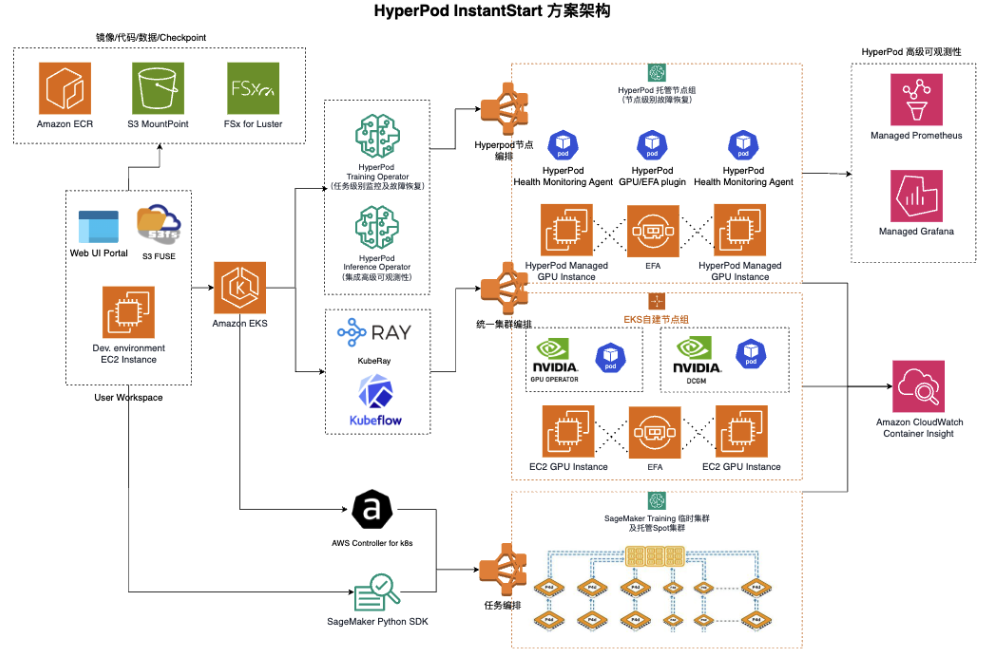

# HyperPod-InstantStart

HyperPod InstantStart is a training-and-inference integrated platform built on SageMaker HyperPod. It utilizes standard EKS orchestration and supports training and inference tasks with arbitrary GPU resource granularity. 

## Overview

HyperPod-InstantStart provides a unified interface for managing large-scale ML infrastructure, from cluster provisioning to training job orchestration and model serving.

- For training, it can leverage standard Kubeflow on Kubernetes (compatible with both EC2 and HyperPod nodes), the HyperPod Training Operator (applicable to HyperPod nodes, significantly simplifying distributed configuration with process-level restart, business log exception monitoring, and recovery capabilities; optional), or KubeRay (as an orchestrator for VERL's reinforcement learning framework). 
- For inference, it supports deployment on single or multi-node setups (with model parallelism or tensor parallelism) using arbitrary containers, such as standard vLLM/SGLang containers, while also providing standardized API exposure (e.g., OpenAI-compatible interfaces). Additionally, it offers managed MLFlow Tracking Server for storing training metrics, enabling sharing and collaboration with fine-grained IAM permission controls.

## Architecture

## Key Components

### Web UI Panel
- **Multi-cluster Management**: Centralized control of multiple EKS environments
- **Cluster Management**: Create and configure EKS clusters with dependency management
- **Training Orchestration**: Submit and monitor distributed training jobs
- **Model Serving**: Deploy inference endpoints with load balancing
- **Real-time Monitoring**: WebSocket-based status updates and logging
- **Traffic Management**: Intelligent second level traffic rebalancing

### CLI Tools
- **Infrastructure as Code**: CloudFormation templates for reproducible deployments
- **Automated Setup**: One-click cluster provisioning and configuration

### Training Recipes
- **Framework Support**: Pre-configured templates for popular ML frameworks
- **Distributed Training**: Optimized configurations for multi-node training
- **Custom Workloads**: Extensible recipe system for custom training scenarios

### Model Pool Manager
- **Kubernetes-native**: Container-based model serving with auto-scaling

For detailed setup instructions, please refer to Feishu doc: https://amzn-chn.feishu.cn/docx/VZfAdXTJKor7TCxPrZdcbGYXnaf?from=from_copylink